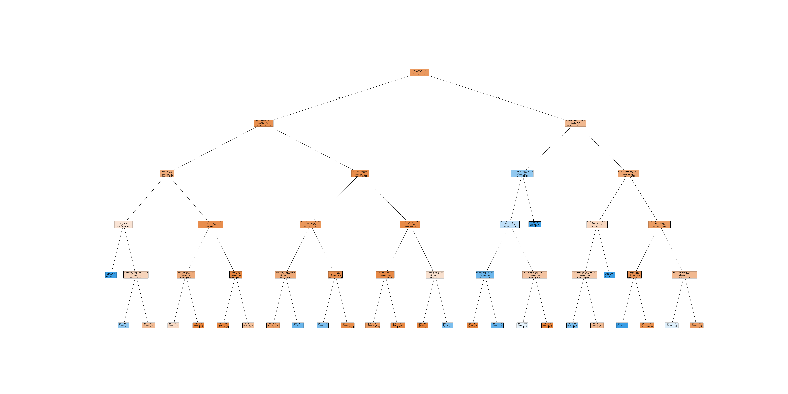
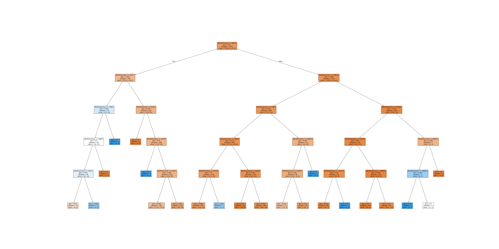
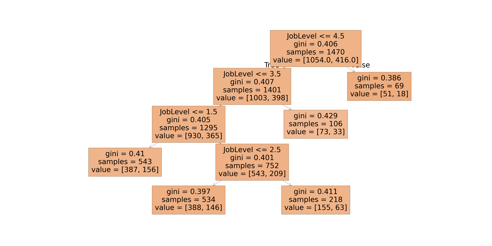

# Employee Attrition 

## Introduction

Ce projet a pour but de prédire l'attrition des employés d'une entreprise. 
Les données utilisées: https://www.kaggle.com/datasets/patelprashant/employee-attrition

## Prérequis
````python
pip install scikit-learn matplotlib pandas
````

## Utilisation
````python
python main.py
````

## Lire les valeurs

Un arbre de décision se sépare en branche pour prédire les valeurs. Chaque "case" contient plusieurs paramètres:
- **variable**: La variable que l'on compare à une valeur pour prendre une décision.
- **gini**: L'indice de Gini, qui mesure l'impureté d'un noeud. Plus l'indice est bas, plus le noeud est pur.
- **samples**: Le nombre d'échantillons dans le noeud.
- **value**: Le nombre d'échantillons de chaque classe dans le noeud. Souvent, on a deux valeurs: le nombre d'échantillons de la classe 0 et le nombre d'échantillons de la classe 1.
- **class**: La classe prédite pour le noeud. C'est la classe majoritaire dans le noeud.

Ensutie, cette "case" se divise en deux branches:
- **left**: La branche de gauche. C'est la branche que l'on prend si la condition est vraie.
- **right**: La branche de droite. C'est la branche que l'on prend si la condition est fausse.

Le schéma se répète pour chaque branche jusqu'à ce que l'on atteigne la max_depths.

## Prédire si l'employé va quitter l'entreprise (Attrition)



Sur ce graphique, on peut voir que les employés qui ont un salaire plus élevé et qui ont été promus récemment sont moins susceptibles de quitter l'entreprise.
J'ai utilisé les paramètres suivants pour prédire l'attrition des employés:
Age, DistanceFromHome, JobSatisfaction, JobInvolvement, EnvironmentSatisfaction, MonthlyIncome, OverTime, YearsAtCompany

### Exemple de lecture:
Si l'employé fait des heures supplémentaires, que ça fait moins d'un an et demi qu'il travail dans l'entreprise, avec un age inférieur à 32,5, et un job involvement inférieur à 1,5, alors il est probable qu'il quitte l'entreprise.

### Conclusion
Les employés qui ont un salaire plus élevé et qui ont été promus récemment sont moins susceptibles de quitter l'entreprise.

## Prédiction pour savoir si le salaire est important pour l'attrition de l'employée



### Exemple de lecture:
Les employés avec un salaire menseul inférieru à 2023,0 sont susceptibles de quitter l'entreprise.
Les employés avec un salaire menseul supérerieur à 19892.5 sont moins susceptibles de quitter l'entreprise.
Parmis deux employés avec un salaire mensuel supérieur à 19846.0, l'un d'entre eux peut quitter l'entreprise. Un autre paramètres est à prendre en compte.

### Conclusion
Le salaire peut être un facteur important pour prédire l'attrition des employés.

## Prédiction pour savoir si on fait des heures supplémentaires selon le job level



### Exemple de lecture:
Le job level n'afflu pas sur le fait de faire des heures supplémentaires.
Cependant, grâce à ce graphique, on peut voir que dans tous les job level, 1/3 des employés font des heures supplémentaires.

### Conclusion
Le job level n'afflu pas sur le fait de faire des heures supplémentaires.

